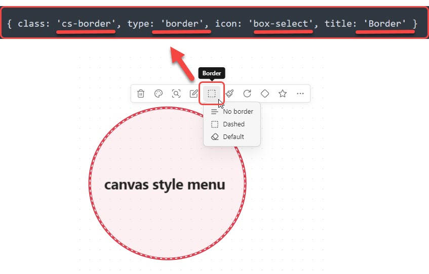
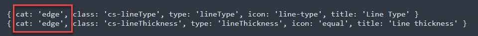
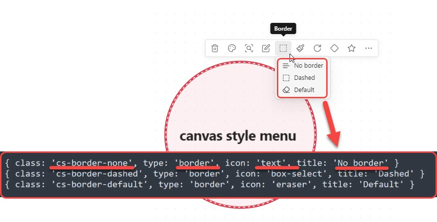
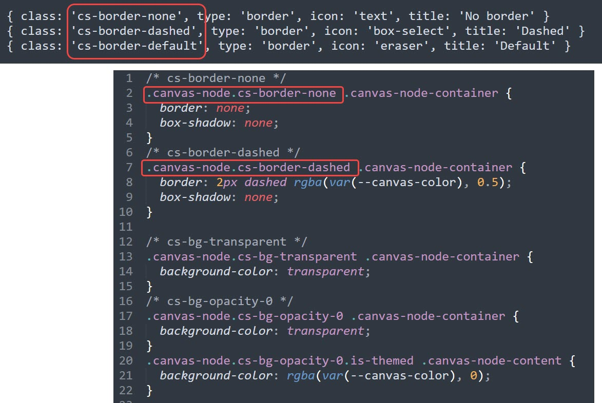
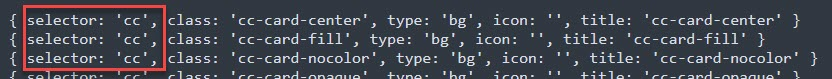
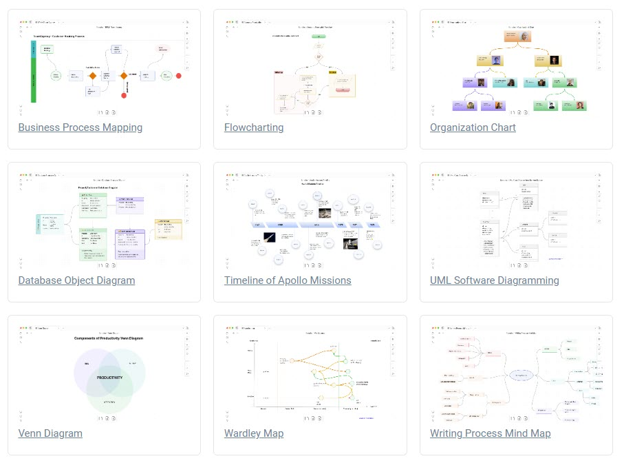
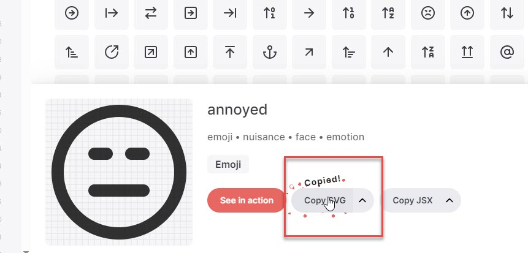

# Obsidian Canvas Style Menu

[中文说明](README_CN.md)

First of all, I want to express gratitude to @[Quorafind (Boninall) (github.com) ](https://github.com/Quorafind)for bringing us many fantastic and practical plugins:

- [Obsidian-Memos](https://github.com/Quorafind/Obsidian-Memos)
- [Obsidian-Card-Library](https://github.com/Quorafind/Obsidian-Card-Library)
- [Obsidian-Canvas-MindMap](https://github.com/Quorafind/Obsidian-Canvas-MindMap)
- [Obsidian-Collapse-Node](https://github.com/Quorafind/Obsidian-Collapse-Node)
- and more...

**Obsidian Canvas Style Menu is based on [Obsidian-Collapse-Node](https://github.com/Quorafind/Obsidian-Collapse-Node). I modified the relevant code, added new features, and created this new plugin.

Once again, thank you for allowing me to use your code!!!

**Obsidian Canvas Style Menu** allows you to seamlessly modify canvas card styles through the canvas menu and supports the extension of styles using your own CSS snippets.

## Usage

**Obsidian Canvas Style Menu **comes with several simple styles that you can directly use in the style menu, right-clicking on the button allows you to remove the style. You can also extend or override the default style menu using your own menu configuration and CSS snippets. Simply add your own menu configuration on the plugin settings page. Here's a brief explanation, and detailed documentation will be added later.

1. First, add Menu configuration:

**Note: The default Menu Config added is for style menus on cards. If you want to add style menus for connection lines, simply add `cat: 'edge'` in the Menu Config.**

2. Second, add Sub Menu configuration:
**Note: No need to add `cat: 'edge'` in the Sub Menu Config.**

3. Third, add your own CSS snippets, where the class names for each style should correspond to the class names in your menu configuration:

4. Fourth, congratulations, you can now use the styles you added in the style menu!

**Note:** If your menu does not have sub-menus, the menu button will become a toggle button. Left-click applies the style, and right-click cancels the style.

**Obsidian Canvas Style Menu** supports the optional Obsidian default cssclasses styling method. You can achieve the effect of cssclasses without manually writing cssclasses by simply adding `selector: 'cc'` in your Menu Config.

**For [Canvas Candy](https://tfthacker.com/canvas-candy) users, no need to write cssclasses anymore. Simply add the commonly used Canvas Candy cssclasses to the menu configs for easy use.**

**Note: Canvas Candy is a paid product and is not included in Canvas Style Menu. If you wish to use it, please visit [Canvas Candy](https://tfthacker.com/canvas-candy) for more information.**

**Obsidian Canvas Style Menu** supports adding custom icons. On the plugin settings page, scroll to the bottom, enter the icon name and SVG code, then click the add button on the left.

How to get an SVG icon? 
Taking [Lucide](https://lucide.dev/) icons as an example, find the desired icon, click the "Copy SVG" button, then paste it on the plugin settings page. 
**Note that the icon must comply with Obsidian's [Icon design guidelines](https://docs.obsidian.md/Plugins/User+interface/Icons#Icon+design+guidelines)**.

## Installation

- Not ready for market yet
- Can be installed via the [Brat](https://github.com/TfTHacker/obsidian42-brat) plugin
- Manual installation

1. Find the release page on this github page and click
2. Download the latest release zip file
3. Unzip it, copy the unzipped folder to the obsidian plugin folder, make sure there are main.js and manifest.json files
   in the folder
4. Restart obsidian (do not restart also, you have to refresh plugin list), in the settings interface to enable the
   plugin
5. Done!

## Say Thank You

If you are enjoy using Obsidian-Canvas-Style-Menu then please support my work and enthusiasm by buying me a coffee on [https://www.buymeacoffee.com/michaellw](https://www.buymeacoffee.com/michaellw).

